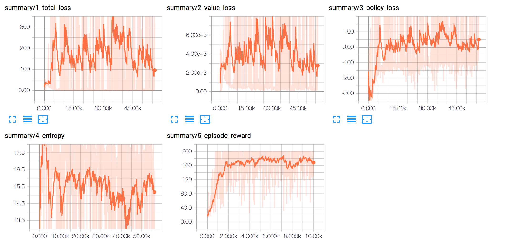

# ppo

implementation of Proximal Policy Optimization Algorithms, OpenAI, 2017 (arxiv:1707.06347v2)

run main.py to replicate results (200 max score)

results from 10000 training episodes (with weight-sampled actions) on the cartpole problem from OpenAI gym. The problem is solved ~1000 episodes in with a single size 1024 hidden layer

